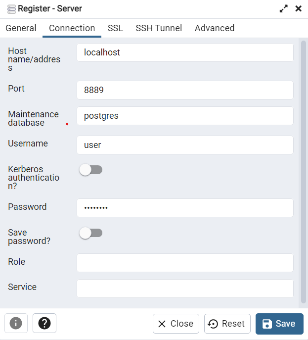

# Skincare Routine Tracker

## Description
The Skincare Routine Tracker is a simple app that helps you keep track of your skincare routines.

## Tech stack:
- Node JS backend for CRUD operations on routines, products and for user authentication.
- Prisma ORM with PostgreSQL database
- Swagger documented API's available at `http://{host}:{port}/api-docs`. By default, application will run on `http://localhost:3000`

## Features
- JWT based authentication
- Create-read-update-delete skincare products. Retrieval of all products is paginated by default to **page 1** of **size 10**. `page` & `pageSize` parameters are optional and can be included if necessary.
- Create-read-update-delete your skincare routines by referencing the products you want to use. Retrieval of all routines can be filtered by `name` parameter. For example: `http://localhost:3000/routines?name=mornin` should retrieve only the routines that contain **mornin** in their name.
- Middlewares for handling authentication, request validation, file upload using Multer

## Entity-Relationship diagram

## Installation
### Pre-reqs:
- Make sure you have NodeJS and Docker installed on your machine
- *Optional: PgAdmin for connection to DB to view data and tables*

### Running locally:
1. Clone the repository: `git clone https://github.com/mtelea/skincare-routine-tracker.git`
2. Install the required dependencies: `npm install`
3. Build the app: `npm run build`
4. Start DB in docker container: `docker compose up`
5. *Optional: if you'd wish to see schema along with tables, open PgAdmin -> right click on servers -> Register -> Server and add below configuration:*

6. Generate Prisma client: `npm run generate`
7. Apply migrations to your database: `npm run migrate`
8. Start server: `npm run start`